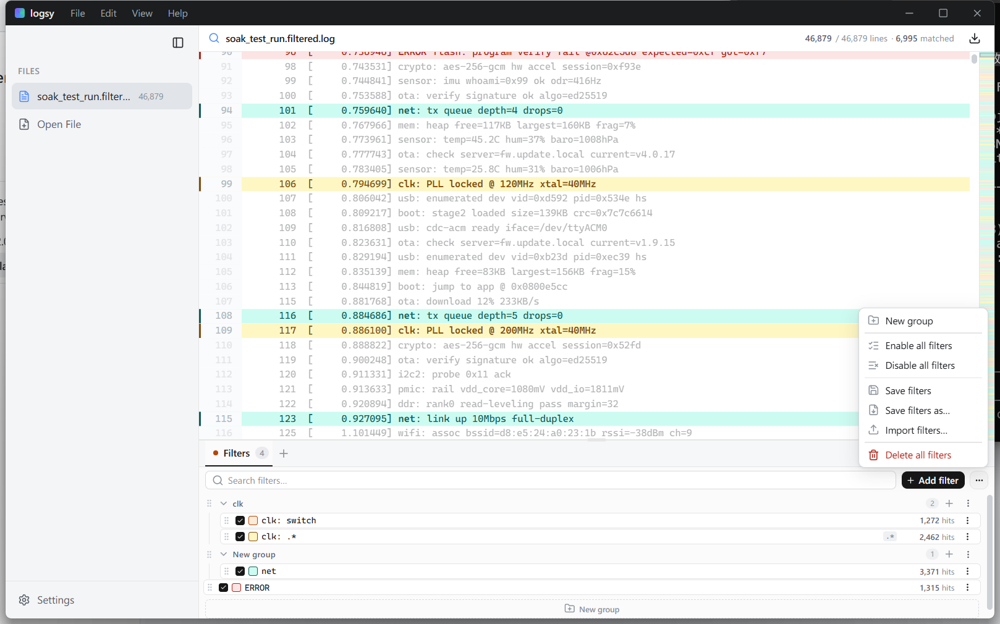

# Logsy

A fast desktop log viewer for embedded / firmware debug logs. Open large log
files, then highlight, dim, or hide lines with reusable, colour-coded filters.

Built with **Tauri v2 · React 19 · TypeScript · Vite**.



## Features

- **Open logs from disk** via dialog (`Ctrl O`) or by **dragging & dropping**
  files anywhere onto the window. Multiple files open as tabs.
- **Filters** that highlight matching lines (or *exclude* them to cut noise),
  with plain-text or regex patterns and optional case sensitivity.
- **Filter sets** (the tabs) each contain **filter groups** (collapsible
  sub-sections) so you can organise filters per investigation.
- **Searchable colour pickers** for filter text/background, plus quick presets.
- **Find in view** (`Ctrl F`), **matches-only** mode (`Ctrl H`), a match map,
  line numbers, and zoom — all over a virtualized list that stays smooth on
  large files.
- **Save / import filters** as JSON to share or reuse filter sets.

## Prerequisites

- [Bun](https://bun.sh) (package manager + script runner)
- [Rust](https://www.rust-lang.org/tools/install) (stable toolchain, for Tauri)
- Platform build dependencies for Tauri — see the
  [Tauri prerequisites guide](https://tauri.app/start/prerequisites/).
  On Debian/Ubuntu that means `libwebkit2gtk-4.1-dev`, `libgtk-3-dev`,
  `librsvg2-dev`, `patchelf`, and friends.

## Getting started

```bash
bun install          # install frontend dependencies
bun run tauri dev    # launch the desktop app (first Rust build takes a few min)
```

Prefer the browser for quick UI iteration? `bun run dev` serves just the
frontend on http://localhost:1420 (window controls and file I/O need the
desktop shell, though).

## Building installers locally

```bash
bun run tauri build
```

Installers are written to `src-tauri/target/release/bundle/` — `.msi`/`.exe`
on Windows, `.dmg` on macOS, `.deb`/`.AppImage` on Linux.

## Keyboard shortcuts

| Shortcut            | Action                          |
| ------------------- | ------------------------------- |
| `Ctrl O`            | Open log file(s)                |
| `Ctrl F`            | Find in view                    |
| `Ctrl H`            | Toggle matches-only view        |
| `Ctrl` `+` / `-`    | Zoom in / out (also `Ctrl`+scroll) |
| `Ctrl 0`            | Reset zoom                      |
| `Esc`               | Close find                      |

## Releasing

Releases are automated by GitHub Actions
([`.github/workflows/release.yml`](.github/workflows/release.yml)). Pushing a
`v*` tag builds installers on Windows, macOS, and Linux and publishes them to a
**draft** GitHub Release for you to review and publish.

### 1. Bump the version

The app version lives in three files that must stay in sync (`package.json`,
`src-tauri/tauri.conf.json`, `src-tauri/Cargo.toml`). The `bump` script edits
all three, commits, and creates the tag in one step:

```bash
bun run bump patch    # 0.1.0 -> 0.1.1
bun run bump minor    # 0.1.0 -> 0.2.0
bun run bump major    # 0.1.0 -> 1.0.0
bun run bump 0.5.2    # set an explicit version
```

Flags: `--no-commit` (edit files only) · `--no-tag` (commit but don't tag).
The script refuses to run if the tag already exists or if you have unrelated
staged changes.

### 2. Push to trigger the build

The bump script does **not** push (pushing the tag is what starts the release):

```bash
git push && git push origin v0.2.0
```

Then watch the **Actions** tab; when it's green, open **Releases**, review the
draft, and **Publish**.

> To release the current version without bumping (e.g. the first `v0.1.0`),
> just tag and push manually:
> ```bash
> git tag v0.1.0 && git push origin v0.1.0
> ```

> [!NOTE]
> If the release step fails with a `403`, enable write access at
> **Settings → Actions → General → Workflow permissions → Read and write**.
> Binaries are unsigned, so Windows SmartScreen / macOS Gatekeeper will warn on
> first launch.

## Project structure

```
src/                 React frontend
  components/         LogView, FilterPanel, Sidebar, EditModal, ui/ (Base UI)
  data.ts            palettes, makeFilter, initial/normalize state
  logic.ts           filter compile / match / view computation
  App.tsx            root state, persistence, file loading, shortcuts
src-tauri/           Tauri (Rust) backend; window controls + file read/write
scripts/bump.mjs     version-bump + tag helper
```

## License

[GPL-3.0](LICENSE)
