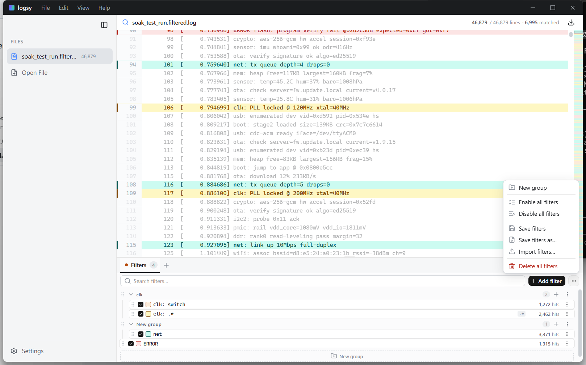

# Logsy

A fast desktop log viewer for embedded / firmware debug logs. Open large log
files, then highlight, dim, or hide lines with reusable, colour-coded filters.

Built with **Tauri v2 · React 19 · TypeScript · Vite**.



## Features

- **Open logs from disk** via dialog (`Ctrl O`) or by **dragging & dropping**
  files anywhere onto the window. Multiple files open as tabs.
- **Filters** that highlight matching lines (or _exclude_ them to cut noise),
  with plain-text or regex patterns and optional case sensitivity.
- **Filter sets** (the tabs) each contain **filter groups** (collapsible
  sub-sections) so you can organise filters per investigation.
- **Searchable colour pickers** for filter text/background, plus quick presets.
- **Find in view** (`Ctrl F`), **matches-only** mode (`Ctrl H`), a match map,
  line numbers, and zoom — all over a virtualized list that stays smooth on
  large files.
- **Save / import filters** as JSON to share or reuse filter sets.

## Release highlights

Major features added in each minor version (see the
[releases page](../../releases) for full changelogs):

| Version  | Main features                                                                                                                                                                                                                                                                                       |
| -------- | --------------------------------------------------------------------------------------------------------------------------------------------------------------------------------------------------------------------------------------------------------------------------------------------------- |
| **v0.1** | Initial release — open large log files as tabs, colour-coded highlight/exclude filters (text or regex), find-in-view, matches-only mode, match map, virtualized rendering, JSON save/import.                                                                                                        |
| **v0.2** | Structured field parsing — parse profiles, columnar view, per-line field tables (Alt+click) and comparison tables for multi-selected lines; dockable/collapsible Filters + Compare panels; undo/redo with lazy field extraction; multiple-lists drag-and-drop; `.tat` import; tabbed filter editor. |
| **v0.3** | Line bookmarks panel with previews; multi-encoding file open; interactive regex/pattern builder (chip merge/split, capture/generalize, seed-from-line); live match preview + create-filter-from-selection; shortcuts modal, loading overlay, combined colour-pair palette; per-file icon picker.    |
| **v0.4** | Event timeline panel — Timeline canvas, date+time stamp parsing, per-point detail cards with inter-point deltas, filter→track flow; filter selection mode with batch delete; append-import (merge into current set); rich logline hover cards; per-file scroll memory; drag-to-reorder open files.  |
| **v0.5** | Filter packs — a reusable filter-set library to save, organize and insert filters via a slide-out drawer; copy a selection of filters into another set.                                                                                                                                             |

## Prerequisites

- [Bun](https://bun.sh) (package manager + script runner)
- [Rust](https://www.rust-lang.org/tools/install) (stable toolchain, for Tauri)
- Platform build dependencies for Tauri — see the
  [Tauri prerequisites guide](https://tauri.app/start/prerequisites/).
  On Debian/Ubuntu that means `libwebkit2gtk-4.1-dev`, `libgtk-3-dev`,
  `librsvg2-dev`, `patchelf`, and friends.

## Getting started

```bash
bun install          # install frontend dependencies
bun run tauri dev    # launch the desktop app (first Rust build takes a few min)
```

Prefer the browser for quick UI iteration? `bun run dev` serves just the
frontend on http://localhost:1420 (window controls and file I/O need the
desktop shell, though).

## Building installers locally

```bash
bun run tauri build
```

Installers are written to `src-tauri/target/release/bundle/` — `.msi`/`.exe`
on Windows, `.dmg` on macOS, `.deb`/`.AppImage` on Linux.

## Performance profiling

The log-processing core in [`src/lib/engine.ts`](src/lib/engine.ts) is what keeps the UI
smooth on large files. [`scripts/profile.ts`](scripts/profile.ts) benchmarks it
in isolation (no React, no Tauri) against a synthetic firmware log, reporting what
each stage of opening a file costs and how the JS and Rust scanners compare:

```bash
bun run scripts/profile.ts                          # defaults: 200k lines, 20 filters
bun run scripts/profile.ts --lines=500000 --filters=100
bun run scripts/profile.ts --no-rust                # JS only, no cargo toolchain needed
bun run scripts/profile.ts --json                   # machine-readable, for CI / before-after
```

Flags: `--lines=N` · `--filters=N` · `--runs=N` (odd → median) · `--cold-runs=N` ·
`--warmup=N` · `--seed=N` (reproducible logs) · `--no-rust` · `--quiet` · `--json`.
Run `bun run scripts/profile.ts --help` for the authoritative list.

A default run takes ~21 s at 500k lines × 100 filters, most of it inside one
benchmark, so a progress line on **stderr** reports the phase, the run and the
estimated time left:

```
[4/11] js: computeView (cold)  run 2/3  ~3.3 s each, ~6.7 s left
```

It is a plain overwritten line, not a spinner: each run holds the event loop for
its whole duration, so an animation would freeze during exactly the wait it is
meant to cover. It goes to stderr so stdout stays exactly the report, and is off
under `--json`, `--quiet`, or when stderr is not a terminal.

The report **ends** with what opening a file costs, stage by stage, with both paths
as columns — the terminal is scrolled to the bottom when a run finishes, so the last
thing printed is the first thing read. Only the match scan differs; every other
stage is the same work on both sides, so the comparison is a substitution rather
than two unrelated totals:

```
══ opening a 11.5 MB log — 200,000 lines × 100 distinct filters ══

  stage                               JS only  Rust-primed
  ────────────────────────────────────────────────────────
  js: splitLines                     17.00 ms     17.00 ms
  js: match scan                   1190.23 ms            —
  rust: split_lines                         —      7.69 ms
  rust: RegexSet scan (rayon)               —     45.09 ms
  js: verify (spot-check)                   —      0.49 ms
  js: primeMatchCache                       —      0.04 ms
  js: computeView (compose)          18.71 ms     18.71 ms
  ────────────────────────────────────────────────────────
  total                            1225.94 ms     89.03 ms   13.8× faster

  not measured here (same on both paths): file read + decode, and the IPC
  that carries the text and the bit sets — see docs/perf-large-file-open.md

  cross-check: scan + compose = 1208.95 ms vs computeView (cold) 1203.69 ms
```

The match scan is measured **directly**, via `scanAll` in `engine.ts`, rather than
derived by subtracting a warm `computeView` from a cold one. That is what makes the
cross-check meaningful: `scan`, `compose` and cold `computeView` are three
independently measured numbers that have to agree, and a subtraction could never
disagree. The Rust timings likewise come from `scan_text`'s own `Instant`s in the
result blob, so they contain none of this harness's process spawn or JSON. The Rust
helper is rebuilt every run (`--release`, ~0.5 s when there is nothing to do) so the
scan can never be measured against a stale binary.

Above the summary, in the order they print: the raw min/median/mean/max samples
(which answer how stable a number is rather than what it costs), then the engine's
other hot paths (`compileAll`, `fieldsFor`, `segments`, `scanMatches` — rendering
and the edit modal, none of them on the open path). Anything that qualifies the
numbers prints above the summary too, so the summary stays the final block.

Colour carries hierarchy, not decoration: **bold** for section titles and the total
row, dim for anything that is not a result (separators, footnotes, and any stage
costing under a millisecond — otherwise a 1200 ms row and a 0.03 ms row have the
same visual weight), and yellow only for something that wants reading, such as a
failed cross-check. No number is coloured by whether it is good or bad — a slow
cold scan is the finding, not a fault. Colour switches itself off when stdout is
not a terminal, under `NO_COLOR`, and under `--json`.

Cold `computeView` dominates and is why opening a file primes the match cache
from Rust (see [`docs/perf-large-file-open.md`](docs/perf-large-file-open.md));
at 200k lines / 100 filters it is ~1.2 s in Bun against ~71 ms primed.
`compileAll` and `segments` (per-rendered-row highlighting) are effectively free.

Two things the synthetic workload has to get right, or every number is optimistic:
the filter patterns must be **distinct** (the match cache keys on regex source +
flags, so repeated patterns are scanned once between them), and the cold benchmark
must hand each run a **fresh lines array** (the cache is keyed by array identity).

## Keyboard shortcuts

| Shortcut         | Action                             |
| ---------------- | ---------------------------------- |
| `Ctrl O`         | Open log file(s)                   |
| `Ctrl F`         | Find in view                       |
| `Ctrl H`         | Toggle matches-only view           |
| `Ctrl` `+` / `-` | Zoom in / out (also `Ctrl`+scroll) |
| `Ctrl 0`         | Reset zoom                         |
| `Esc`            | Close find                         |

## Recovering from a bad state

Logsy remembers your workspace (open files, filters, layout, bookmarks) in the
webview's `localStorage`. If a corrupt or pathological state ever makes the app
freeze or crash **on launch**, the UI is unreachable and can't clear itself — so
two command-line escape hatches run _before_ the frontend loads:

```bash
logsy --reset    # wipe the saved state permanently, then start fresh
logsy --safe     # start clean for this session WITHOUT touching the saved state
```

- **`--reset`** clears everything (open files, filter sets, groups, layout,
  bookmarks). Irreversible — use it when you just want a clean slate.
- **`--safe`** starts from an empty workspace but neither reads nor writes the
  saved state, so it stays intact on disk and a normal launch resumes it. Use it
  to get back in, export your filters, then decide whether to `--reset`.

On Windows the easiest way is a desktop shortcut whose target ends in `--safe`
(or `--reset`). To pass the flag while developing:

```bash
bun run tauri dev -- -- --safe   # first -- → cargo, second -- → the app
```

If even `--reset` won't launch, delete the saved state manually (app closed):

| OS      | Folder to delete                                                     |
| ------- | -------------------------------------------------------------------- |
| Windows | `%LOCALAPPDATA%\dev.logsy.app\EBWebView\Default\Local Storage`       |
| macOS   | `~/Library/WebKit/dev.logsy.app` (or the app's `WebsiteData` folder) |
| Linux   | `~/.local/share/dev.logsy.app` (WebKitGTK local storage)             |

## Releasing

Releases are automated by GitHub Actions
([`.github/workflows/release.yml`](.github/workflows/release.yml)). Pushing a
`v*` tag builds installers on Windows, macOS, and Linux and publishes them to a
**draft** GitHub Release for you to review and publish.

### 1. Bump the version

The app version lives in three files that must stay in sync (`package.json`,
`src-tauri/tauri.conf.json`, `src-tauri/Cargo.toml`). The `bump` script edits
all three, commits, and creates the tag in one step:

```bash
bun run bump patch    # 0.1.0 -> 0.1.1
bun run bump minor    # 0.1.0 -> 0.2.0
bun run bump major    # 0.1.0 -> 1.0.0
bun run bump 0.5.2    # set an explicit version
```

Flags: `--no-commit` (edit files only) · `--no-tag` (commit but don't tag).
The script refuses to run if the tag already exists or if you have unrelated
staged changes.

### 2. Push to trigger the build

The bump script does **not** push (pushing the tag is what starts the release):

```bash
git push && git push origin v0.2.0
```

Then watch the **Actions** tab; when it's green, open **Releases**, review the
draft, and **Publish**.

> To release the current version without bumping (e.g. the first `v0.1.0`),
> just tag and push manually:
>
> ```bash
> git tag v0.1.0 && git push origin v0.1.0
> ```

> [!NOTE]
> If the release step fails with a `403`, enable write access at
> **Settings → Actions → General → Workflow permissions → Read and write**.
> Binaries are unsigned, so Windows SmartScreen / macOS Gatekeeper will warn on
> first launch.

## Project structure

```
src/                 React frontend
  components/         UI — LogView, FilterPanel, timeline, compare,
                     packs/, dialogs/, layout/, widgets/, ui/ (Base UI)
  store/             Zustand state (sliced) + persistence
  hooks/             feature hooks (log files, bookmarks, compare, timeline, …)
  lib/               core logic — engine.ts (compile/match/view), parsing,
                     regex builder, palettes, filter file I/O
  state/, config.ts, types.ts   selectors, app config, shared types
  App.tsx            root composition, wires state + features together
src-tauri/           Tauri (Rust) backend; window controls + file read/write
scripts/bump.mjs     version-bump + tag helper
scripts/profile.ts   benchmarks the engine.ts log-processing hot path
```

## License

[GPL-3.0](LICENSE)
